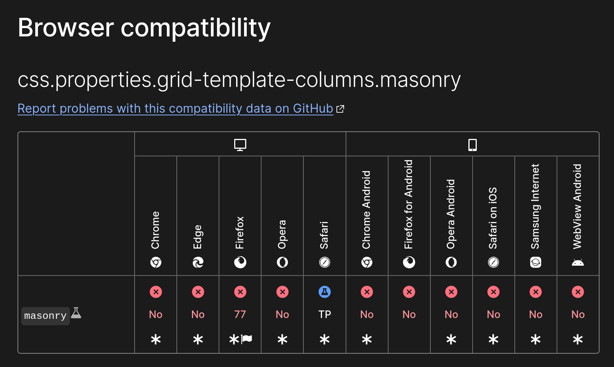

# Masonry Layout

This template provides simple copy paste solution to build masonry layout for you. <br/>
No libs needed, just pure vanilla js.

If this project has helped you in any way or you found it interesting, please consider giving it a star ⭐. <br/>Your support helps me continue to improve and maintain the project, and it means a lot to me!

Remember, a little star can make a big difference!

## Copy paste solution
```tsx
import { images } from './config';

const MAX_COLUMNS = 3

function getColumns(colIndex: number) {
  // Instead of images you can replace it with any other data source
  return images.filter((_, idx) => idx % MAX_COLUMNS === colIndex);
}

function App() {
  return (
    <div className="grid grid-cols-1 sm:grid-cols-3 gap-4">
      {Array.from({ length: MAX_COLUMNS }, (_, colIndex) => (
        <div key={colIndex} className="grid gap-4">
          {getColumns(colIndex).map((img, idx) => (
            <div key={idx} className="replace-with-your-own-component">
              
            </div>
          ))}
        </div>
      ))}
    </div>
  )
}
```

- Define `MAX_COLUMNS` constant
- Replace `images` array with any other data source
- Replace `div` with your own component

## Why?
Because native CSS solution still an experimental solution and not supported by all browsers.


## License
Licensed under the [MIT license](https://github.com/incpo/masonry-layout/blob/main/LICENSE).